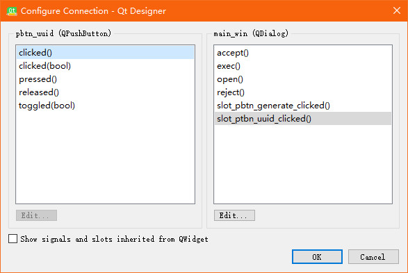

[TOC]


# yys自动化工具
## 源项目地址作者已删除但是为了学习和补充特此重开此项目，其中对于图像识别和游戏窗体绑定的功能进行了剥离，更容易适配多环境

阴阳师护肝的自动化脚本集合。

功能包含（不局限）：

1. 御魂挂机，组队，单人
2. 结界突破
3. 业原火
4. 御灵
5. 活动预留功能


PS：**为了维护公平的游戏环境，鼓励大家手动游戏**。

脚本有风险，尽量仅学习 Python 使用。

使用帮忙见：[常见问题及解决方法](#常见问题及解决方法)


## 主版本更新记录

### 2022.06.29 修复了困28的一些问题

1. 修复了困28的拖拽问题，目前的实现方式也不太好需要想办法优化下


### 2021.07.22 sp面灵气活动

1. 增加活动预留-sp面灵气活动挂机


### 2021.07.06 阿修罗活动

1. 增加活动预留-sp面灵气活动挂机


### 2021.05.31 后台处理+妖气封印

1. 添加后台处理
2. 添加妖气封印


### 2021.04.27 使用原始窗体大小

1. 使用原始界面的窗体进行重新程序修改


### 2021.01.01 增加点击模式和日轮之城

1. 增加通用点击模式
2. 新增日轮之城的挑战


2021.03.25 补充：

1. **工具不再进行更新**，也不再提供程序下载。
2. 仓库暂时不撤掉，供学习 python 的有缘人一起交流学习。


## 软件介绍

### 支持的功能

当前软件支持的功能：

1. 御魂
2. 困28单人，困28组队
3. 御灵
4. 业原火
5. 结界突破
6. 点击模式
7. 活动预留

还有一些功能没有适配**后台运行**，所以可能存在问题，或者是未支持。

其他功能：

1. 业原火 + 换狗粮
2. 日轮之城 + 组队 + 换狗粮


### 硬件环境

- 软件环境：win7 , win10

- 硬件要求：非 4K 屏显示器（之前有朋友反馈 4K 屏不能正常使用）

- 分辨率：要求 1080p ，其他分辨率图片会匹配不上，暂不考虑支持

- 软件依赖：官方版本的阴阳师 PC 客户端

- 软件获取： 
  - 群文件，点击链接加入群聊：暂不再提供加群链接， python 爱好都可以私信。
  - 开发者可自行编译打包，详见开发部分文档
  
- 项目 gitee 链接：https://github.com/brownursidaeR/yyscript

  

  ### 重要声明

  - 本项目仅供学习用，请勿传播
  - **使用脚本工具破坏游戏平衡，且有鬼使黑警告风险。若因使用脚本被封号，本人概不负责。**
  - **不保证绝对安全。没有留后门。**有感兴趣且懂技术的可以自动查找源代码。


### 使用技术说明


图像识别 + 图像匹配（opencv） + 模拟人工操作 + 自动循环检测执行。

具体说明：

图片识别 + 图像匹配 + 自动点击。

通过将事先截好的游戏画面的图，与当前执行的阴阳师客户端的界面进行比对。如果图像匹配上，按照设定的方法去自动执行，如点击，拖拉等。最终是通过模拟人为操作，去实现一系列循环的操作。

其他自动点击是在图像匹配的区域去随机点击。举例说明：如匹配到挑战按钮，识别一个矩形框，随机在框内进行点击。


### 软件结构介绍

主要包括四个文件或目录

1. conf 配置文件，可能通过修改参数进行定制化的功能修改。配置文件为 **config.ini** 
2. screenshot  程序用到的截图文件。一般情况下不建议自行替换截图文件。如部分图片匹配不上时，可自行截图替换。**并反馈修改。**
3. exe 文件即可执行文件，点击运行脚本
4. debug.log 运行中产生，发生异常时可以用来追踪一些问题


拿到软件包之后的具体操作步骤如下：

解压（不能有中文路径） -> 双击可执行文件 -> 选择功能 -> 选择参数 -> 点击开始

解压后的文件结构，debug.log 可能需要运行时才会出现：


成功打开后的界面如下：


启用一个功能的顺序：

1. 选择对应功能
2. 参数设置的那6个选项中设置对应的参数
3. 点击开始进行挑战


### config.ini 配置文件说明

参数在 conf 文件夹下面的 config.ini 文件中，右键用记事本打开，下图是用 notepad++ 打开。


ini格式说明：

1. [general]，[]包含的是哪个功能配置，general是通用信息，用来设置界面
   1. title，窗口标题
   2. attention，注意事项
   3. width，height，窗体大小（不能更改）
   4. **licence**，认证码，用来限定认证过期时间
   5. 其他#开头的是注释说明
   6. 其他没有特别说明可能是冗余配置，没有实际作用


### 脚本的执行概述

执行步骤如下：

1. 选择功能，设置参数。
2. 点击开始，开始加载截图和配置项
3. 界面截图并比对截图，如匹配上截图执行对应的操作。如果一直没有比对到截图，一定时间后会自动退出程序
4. 执行操作后重复执行 3 ，直到触发结束标志


结束标志可能有：

1. 达到配置的循环次数
2. 功能预定的结束点，如结界突破没有挑战券了
3. 达到一定次数没有匹配上截图


## 功能使用

### 御灵使用

使用方法：


循环状态：只要符合下面状态时，才可以正常进入循环挑战。


注意事项：如果对应的类型没有开放的话，会自动切换类型，默认优先级顺序是豹子 -> 狐狸 -> 凤凰 -> 神龙。


### 御魂

使用方法


参数说明：

总共涉及的参数有下面几个：

1. 单人，双人，三人
2. 队长，队员
3. 循环次数


循环状态：只要符合下面状态时，才可以正常进入循环挑战。


注意事项

1. 因为组队挑战的话，涉及邀请组队和接受邀请组队的情况。如果此时有其他人邀请你打妖气封印的话，会点击接受，从而退出挑战。
2. 所以如果你好友比较多，大家都喜欢拉你打个妖气封印，金币妖怪，经验妖怪什么的，**需要定期查看是否有热心好友邀请**。
3. 组野队小心被举报。


### 业原火

使用方法


更换狗粮说明：

业原火我都是拿来作为狗粮，如果选择不带狗粮的话就不用看后面的了。

带狗粮的话，我一般是1+1+3。所以我限定的狗粮区域只有3只会去替换。更换狗粮时根据选择的狗粮类型进行替换。


参数说明：

总共涉及的参数有下面几个：

1. 更换狗粮，不更换
2. 循环次数
3. 狗粮类型，如果选择不更换，这个参数没有什么意思。


循环状态：

只要在符合下面两个图中状态，都是可以正常进入循环挑战。


注意事项：

1. 业原火的狗粮替换目前没有遇到说满级的狗粮没有更换的情况。
2. 涉及更换狗粮的场景，一律推荐使用白蛋。


### 结界突破

使用方法：


结界突破的流程：

1. 进行寮突破，直接全部完成，或者是6次用完了
2. 进行个人突破，直接没有挑战券或者是9个格子中有挑战失败的情况
3. 当进入一个挑战时，锁定**第四个位置**
4. 如果存在挑战失败，**自动点击刷新**。如果刷新还在CD，等待一段时间后再进行匹配。


循环状态：


### 升级狗粮-暂不可用

使用方法：


参数说明：

总共涉及的参数有下面几个：

1. 升级狗粮可选，2->3表示2星升3星；3->4表示3星升4星，升级仅使用N卡狗粮。
3. 循环次数

执行流程：

1. 切换到式神录界面
2. 切换到按星级排列，宽松排列
3. 识别到是2->3还是3->4
4. 选择一只满级狗粮，并点击育成
5. 切换到N卡，喂狗粮，点击确认，确认升级
6. 点击确认，重复3-6，直到狗粮不够或者是达到指定数量的狗粮


循环状态：


### 困28-换狗粮

使用方法：


参数说明：

总共涉及的参数有下面几个：

1. 单人，双人
2. 队长，队员
3. 循环次数
4. 狗粮类型


注意事项：

1. **存在一定概率不替换狗粮**。困28组队时，刚进入预选界面时，达摩会跳啊跳的，可能识别出错
2. 无法完全挂机，暂不修复


### 点击模式

使用方法：


这个功能需要自行截图和修改配置文件。

使用步骤：

1. 截图并放在指定目录下， src\screenshot\pattern
2. 截图命名添加到 config.ini 文件中，标签名 loop_keys
   1. 如截图命名为 step1.jpg ， step2.jpg ， step3.jpg ， loop_keys=step1,step2,step3
   2. 记得要找标签是 [pattern] 下面的 loop_keys
3. 启动游戏，注意配置的次数可能无效

配置举例：

```
[pattern]
loop_times=50
# 截图的名称,不要留空格
# loop_keys=step1,step2,step3,step4,step5,step6,step7
# 每次点击之后要休眠的时间，单位是S，只能传整数
sleep_seconds=1
# 一轮循环的标志，暂不支持
loop_key=s7
attention=注意事项说明：\n1. 该模式只适用于识别图片并点击的功能\n2. 含有复杂逻辑时时不能用该模式\n3. 0604活动，锁定阵容即可，放在挑战的界面上
# None指截全图
win_name=阴阳师-网易游戏
```

注意事项：

因为每个图的回调都是点击，防止图片过小被鼠标遮挡，每次点击都会往右下角移动一定距离。

winname 实在不好设置时，设置成 None ，这个是截取整个屏幕。


## 开发指南（修改中）（玩家不用看）

### 框架介绍

框架说明：


loop 循环


### 环境安装配置

每一个具体知识点的分解，可以看**单功能调试**文件夹里面的 jupyter 文件。

如果 jupyter 没有安装，可以通过命令安装 jupyter ，

```
pip install jupyter
pip install pyautogui pywin32 pywin32-ctypes
pip install configparser
pip install matplotlib opencv-python opencv-contrib-python numpy
```


### 配置解析

使用 ini 文件的配置格式，为方便使用，基于 configparser 库进行简单的再封装。详细见 conf/conf_parser.py 文件。

按值的类型封装一层，当配置含有多个 sections 时，解析成对应的成员属性。举例说明：

```ini
[yuling]
loop_times=2
# dragon, fox, leopard, phenix
type=dragon
layer=3
attention=注意事项说明：\n1. 暂只支持第3层

[yeyuanhuo]
loop_times=100
change_fodder=False
fodder_type=fodder
attention=注意事项说明：\n1. 暂只支持第3层\n2. 如果是用花带狗粮，花放最左侧，火灵老鼠放第二个位置\n3. 狗粮只替换345三个位置4. 该功能更换狗粮未适配，暂不能用
```

上述配置解析出来的对应：

```py
# sections 对应字典类型数据
self.yuling

# options 对应的具体 key-value
self.yuling['loop_times'] = 2
self.yeyuanhuo['loop_times'] = 100
```

聚合到界面里面即：

```py
self.config.yuling
self.config.yuling
self.config.yeyuanhuo['loop_times']

# 考虑到安全性，一般要添加默认值来使用
self.players = self.config.cur_config.get('players', 1)
self.drag = self.config.general.get('drag_dis', 5)  # 拖动距离
```

特别的指定功能的配置会增加一个变量来识别 self.config.cur_config 。

为解析方便，对各个 section 做了一层冗余的解析，每个 section 实际解析出来，会有其他 section 才会用到的 key-value ，所以不能写回到配置中（写了就影响配置美观）。


### 图像匹配

使用的 opencv 库，也只是简单做了一层封装。因为使用到的功能很少，所以对同一个界面含有多个匹配图时，取巧将匹配的范围做了限定。

#### cv图像匹配

在界面对象中：

```python

locate = screenshot.locate_image_cv2pil

def locate_im(self, check_im, basic_im=None, confidence=0.8,
                  use_rgb=False):
    '''检查图片是否存在, (Image, Image) -> loc or None'''
    try:
        if basic_im is None:
            # im_yys = self.screenshot_exact()
            im_yys = self.window.get_screenshot()
            else:
                im_yys = basic_im
                loc = locate(check_im,
                             im_yys,
                             confidence=confidence,
                             use_rgb=use_rgb)
                return loc
            except Exception as error:
                self.display_msg('截图比对失败：' + str(error))
                return None
```

在封装的库中简单封装，需要指出的是图片**灰度**之后，性能会大幅提升，大概会快上几十倍。这就导致实际是无法识别原图（彩色图片）。==而且实测，当前将灰度参数修改成 RGB 匹配，也匹配不上==。

```python
class Location:
    def __init__(self, x, y, w, h):
        self.left = x
        self.top = y
        self.width = w
        self.height = h

def locate_im_cv2pil(template, target, confidence=0.8, multi_loc=False):
    return locate_im_cv2cv(template, pil2cv(target), confidence, multi_loc)

# 指出 template 在 target_rgb_gray 中的位置
def locate_im_cv2cv(template, target_rgb_gray, confidence=0.8,
                    multi_loc=False):
    h, w = template.shape[0], template.shape[1]
    res = cv2.matchTemplate(target_rgb_gray, template, cv2.TM_CCOEFF_NORMED)
    loc = np.where(res >= confidence)

    locations = []
    for pt in zip(*loc[::-1]):  # zip(*loc[::-1]) 等价于 zip(loc[1], loc[0])
        # cv2.rectangle(target_rgb_gray, pt, (pt[0] + w, pt[1] + h), (0, 0, 255),
        #               2)
        if multi_loc is False:
            return Location(pt[0], pt[1], w, h)
        locations.append(Location(pt[0], pt[1], w, h))

    if len(locations) > 0:
        return locations
    else:
        return None

def pil2cv(image, transform=cv2.COLOR_BGR2GRAY):
    ''' PIL型 -> OpenCV型
    cv2.COLOR_BGR2GRAY 将BGR格式转换成灰度图片
    cv2.COLOR_BGR2RGB 将BGR格式转换成RGB格式 '''
    new_image = np.array(image, dtype=np.uint8)
    if new_image.ndim == 2:
        pass
    elif new_image.shape[2] == 3:
        new_image = cv2.cvtColor(new_image, transform)
    elif new_image.shape[2] == 4:
        new_image = cv2.cvtColor(new_image, transform)
    return new_image
```


#### 图像打印调试

留了几个接口方便调试：

```python
def show_im_by_inc(self, x, y, w, h):
    '''调试时使用，用来获取窗体的位置信息'''
    im_yys = self.screenshot_inc(x, y, w, h)
    im_yys.show()

def show_im_by_loc(self, loc):
    '''调试时使用，用来获取窗体的位置信息'''
    im_yys = self.screenshot_inc(loc.left, loc.top, loc.width, loc.height)
    im_yys.show()

def show_np_im_by_key(self, key):
    '''调试时使用，用来获取图片库的信息'''
    np_im = self.get_image(key)
    if np_im is not None:
        self.screenshot.show_jpg(key)
        else:
            self.display_msg('在图片库中没有找到图片：{0}'.format(key))
```

具体使用示例：

```python
def click_loc_one_and_move_uncover(self, loc):
    self.click_loc_one(loc)
    # self.show_im_by_loc(loc)
    # self.show_np_im_by_key(self.cur_key)
    time.sleep(self.sleep_seconds)

# 结界突破时，显示具体窗体
def person_callback(self, loc):
	if self.person_done is False:
        for box in self.person_inc_boxes:
            # self.show_im_by_inc(box[0], box[1], box[2], box[3])
            # continue    
```


### pyqt5 界面开发

#### ui分离

我们并不想界面有细微的修改之后，我们的窗体类也要对应修改，所以也需要做一些简单的封装，这部分实际有界面开发经验的小伙伴应该能够很够理解。

方式其实也很简单，也是采用聚合代替继承的思想，将 ui 转化成的类当成实际使用窗体的一个成员。一般是 self.ui = Ui_yys_win()  类似这样。

```python
class YysWin(QMainWindow):
    stop_run = pyqtSignal()

    def __init__(self, parent=None, win_name='阴阳师-网易游戏'):
        # Ui_yys_win.__init__(self)
        super(YysWin, self).__init__(parent)
        self.ui = Ui_yys_win()
        self.ui.setupUi(self)
        self.init_window()  # 配置一些界面选项
```

#### 使用 qrc 生成资源文件

qrc 文档生成对应资源的 py 文件，里面的文件文件是静态的内容。

```
pyrcc5 -o dst.py  src.qrc
```

使用时使用 **冒号 + prefix路径前缀 + file相对路径** 。

举例：

images.qrc

```xml
<RCC>
  <qresource prefix="/">
    <file>icons/zhangliang.jpg</file>
  <!-- </qresource> -->

  <!-- <qresource prefix="images"> -->
    <file>icons/pay.jpg</file>
    <!-- <file>images/qun.jpg</file> -->
  </qresource>
</RCC>
```

最终生成命令：

```
pyrcc5 -o images.py  images.qrc
```

生成一个 images.py 文件。

```python
import images

self.ui.lb_qrcode.setPixmap(QPixmap(":/images/images/qun.jpg"))
self.setWindowIcon(QIcon(":/icons/images/zhangliang.ico"))
```


#### UI 文件转 py 文件

```
pyuic5 -o main_widget.py main_widget.ui
```


#### 使用 qt designer 编辑信号和槽

按 **F4** 进行信号和槽的绑定，选择绑定的信号对象和槽对象。

如果指定的槽对象是窗体本身，就可以自定义槽。



自定义槽有一个技巧，如果是用的原生的槽函数，使用 object_name_action() 即可。如： ac_uuid_trigged()


#### 不同界面的信号和槽交互

如脚本执行过程中需要使用将执行的信息打印到界面类上，就需要进行数据通讯。理论上发送者和接收者可以 1 vs N 。

注意需要在 `__init__()` 之前定义。

发信号的类：

```python
class Autogui(QThread):
    # 定义类属性为信号函数
    sendmsg = pyqtSignal(str, str)  # type, msg
    
    # 发送信号
    def display_msg(self, msg):
        '''输出日志到框内'''
        logger.info(msg)
        self.sendmsg.emit(msg, 'Info')
```

接收信号：

```python
class YysWin(QMainWindow):
    # 定义信号发送，仅接收信号时可不定义
    stop_run = pyqtSignal()

    def __init__(self, parent=None, win_name='阴阳师-网易游戏'):
        # Ui_yys_win.__init__(self)
        super(YysWin, self).__init__(parent)
        self.ui = Ui_yys_win()
        self.ui.setupUi(self)
        self.init_window()  # 配置一些界面选项
    
    def display_msg(self, msg, type='Info'):
        if (type == 'Info'):
            '''输出日志到框内'''
            self.ui.pte_msg.moveCursor(QtGui.QTextCursor.End)
            self.ui.pte_msg.insertPlainText(msg + '\n')
        else:
            self.raise_msg(msg)

```

实际使用时互发信号和槽。脚本执行时向窗体发送执行数据，窗体类发送关闭脚本的指令。

```python
class Autogui(QThread):
    # 定义类属性为信号函数
    sendmsg = pyqtSignal(str, str)  # type, msg
    
    # 槽函数
    def display_msg(self, msg):
        '''输出日志到框内'''
        logger.info(msg)
        self.sendmsg.emit(msg, 'Info')
```

及

```python
class YysWin(QMainWindow):
    stop_run = pyqtSignal()

    def __init__(self, parent=None, win_name='阴阳师-网易游戏'):
        # Ui_yys_win.__init__(self)
        super(YysWin, self).__init__(parent)
        self.ui = Ui_yys_win()
        self.ui.setupUi(self)
        self.init_window()  # 配置一些界面选项
    
    def display_msg(self, msg, type='Info'):
        if (type == 'Info'):
            '''输出日志到框内'''
            self.ui.pte_msg.moveCursor(QtGui.QTextCursor.End)
            self.ui.pte_msg.insertPlainText(msg + '\n')
        else:
            self.raise_msg(msg)
    
    def stop_run(self):
        self.stop = True
```

#### label 添加图片和超链接

```python
def init_window(self):
        self.setWindowIcon(QIcon(":/icons/zhangliang.jpg"))  # 设置程序图标
        self.ui.pte_msg.clear()  # 先清空消息窗口

        # 绑定信号和槽
        self.ui.pbt_autocheck.clicked.connect(self.btn_autocheck_clicked)

        # 初始化标签和超链接,当单击标签中嵌入的超链接，希望在新窗口中打开这个超链接时
        self.ui.lb_sponsor.setOpenExternalLinks(True)
        self.ui.lb_sponsor.setText(
            "<a href='https://.com/chike567/new_yysscript/blob/master/src/screenshot/sponsor/pay2.jpg'>求随缘打赏,感谢！</a>"
        )
        # 绝对路径和相对路径都可以
        self.ui.lb_qrcode.setPixmap(QPixmap(sponsor_img_path))
        # self.ui.lb_qrcode.setPixmap(QPixmap(":/icons/pay.jpg"))
```

#### 点击时打开浏览器

```python
import webbrowser as web

def slot_ac_use_trigged(self):
    web.open(
        'https://github.com/brownursidaeR/yyscript.git'
    )
```


### 认证

认证不多做介绍，感兴趣可以看看鉴权的脚本。


#### 时间转化

获取时间戳： time.time() , float 类型，使用时一般转成 int 再做处理。

时间戳转成字符串： expire_str = time.strftime('%Y-%m-%d %H:%M:%S', time.localtime(int(timestamp)))

```python
if __name__ == '__main__':
    # 获取日期
    cur_timestamp = int(time.time())
    
	# 有限时间 3 天
    valid_day = 3
    end_timestamp = cur_timestamp + valid_day * 24 * 60 * 60
    licence = get_licence(uuid, end_timestamp)
    logger.debug('{0}天的licence: {1}，{2}'.format(valid_day, licence,
                                                check_license(licence)))
    
def get_remain_time(encode_str) -> str:
    '''不做鉴权，只校验时间，负数表示加密串异常，正数表示剩余时间'''
    decode_str = base64.b64decode(encode_str.encode('utf-8')).decode()
    elements = decode_str.split('_')
    if len(elements) != 2:
        logger.debug('鉴权失败：解密串格式不对, {0}'.format(encode_str))
        return '加密串异常'

    md5, timestamp = elements[0], int(elements[1])
    logger.debug('从licence中获取到的信息：str={0}, md5={1}, time={2}'.format(
        encode_str, md5, timestamp))

    # 检查时间戳
    local_timestamp = int(time.time())
    if local_timestamp > timestamp:
        logger.debug('鉴权失败：timestamp，{0} < {1}'.format(timestamp,
                                                       local_timestamp))
        return '加密串已经过期'
    else:
        remain_time = timestamp - local_timestamp
        expire_str = time.strftime('%Y-%m-%d %H:%M:%S', time.localtime(int(timestamp)))
        if remain_time > 365 * 24 * 60 * 60:
            return '离认证过期还有超过一年,过期时间:{0}'.format(expire_str)
        elif remain_time > 24 * 60 * 60:
            days = remain_time / (24 * 60 * 60)
            return '离认证过期还有{0}天,过期时间:{1}'.format(int(days), expire_str)
        else:
            return '离认证过期还有{0}秒,过期时间:{1}'.format(int(remain_time), expire_str)
```


### pyinstaller 打包

打包单个文件。

1. 使用 -F 参数，pyinstaller 会将 python 脚步打包成单个 exe 文件
2. 使用 -D 参数，pyinstaller 会将 python 脚步打包成一个文件夹，运行程序时，需要进入该文件夹，点击运行相应的可执行程序
3. 开源通过 -i 参数指定程序的 icon（图标），但这个命令只在 windows 下生效
4. 使用 -n 参数定义打包后文件的名称
5. 使用 -w 关闭 cmd 命令行

```
pyinstall -i xxx.ico -n name -w -D main.py

```

**提醒：pyinstall -F main.py 就可以生成一个 spec 文件。如果要把窗口关掉，将 console 改成 False 。**

打包多个文件，我设置 -i 似乎也没有效果。 pyinstaller.exe -D main.spec 。实际测试加不加 -D 效果是一样的。

```
# -*- mode: python ; coding: utf-8 -*-


block_cipher = None

SETUP_DIR = 'F:\\new_yysscript\\'

a = Analysis(['src\\main.py',
              'src/ui/main_widget.py',
              'src/mainwin.py',
              'src/screenshot.py',
              'src/autogui/win_gui.py',
              'src/autogui/autogui.py',
              'src/tools/licence.py',
              'src/screenshot/images.py',
              'src/auto_yuhun.py',
              'src/auto_chapter28.py',
              'src/auto_yuling.py',
              'src/auto_break.py',
              'src/define.py',
              'src/conf/conf_parser.py',
              'src/conf/yysconfig.py',
              
              ],
             pathex=[],
             binaries=[],
             datas=[],
             hiddenimports=[],
             hookspath=[],
             hooksconfig={},
             runtime_hooks=[],
             excludes=[],
             win_no_prefer_redirects=False,
             win_private_assemblies=False,
             cipher=block_cipher,
             noarchive=False)
pyz = PYZ(a.pure, a.zipped_data,
             cipher=block_cipher)

exe = EXE(pyz,
          a.scripts, 
          [],
          exclude_binaries=True,
          name='网易云音乐',
          debug=False,
          bootloader_ignore_signals=False,
          strip=False,
          upx=True,
          console=False,
          disable_windowed_traceback=False,
          target_arch=None,
          codesign_identity=None,
          entitlements_file=None , icon='neteasecloudmusic.ico')
coll = COLLECT(exe,
               a.binaries,
               a.zipfiles,
               a.datas, 
               strip=False,
               upx=True,
               upx_exclude=[],
               name='网易云音乐')


```


### 日志记录

全局使用同一个 logger ，这样主要是为了可以统一输出到同一个文件中。只需要在最开始的文件中先初始化一个 logger ，然后在每个 .py 文件中去获取对应的 logger 就可以实现跨文件使用同一个 logger 了。

```
# mainwin.py 中定义和初始化
logger = logging.getLogger('kiddo')

def init_logging_level(self):
    configs = self.config.general
    level = configs.get('log_level', 'INFO')
    if level == 'NONE':
        return
    elif level == 'INFO':
        logger.setLevel(logging.INFO)
    else:
        logger.setLevel(logging.DEBUG)

    # BASIC_FORMAT= '%(asctime)s - %(pathname)s[line:%(lineno)d] - %(levelname)s: %(message)s'
    BASIC_FORMAT = '%(asctime)s - %(levelname)s: %(message)s'
    DATE_FORMAT = '%Y-%m-%d %H:%M:%S'
    formatter = logging.Formatter(BASIC_FORMAT, DATE_FORMAT)
    chlr = logging.StreamHandler()  # 输出到控制台的handler
    chlr.setFormatter(formatter)
    fhlr = logging.FileHandler('debug.log', 'w')  # 输出到文件的handler
    fhlr.setFormatter(formatter)
    logger.addHandler(chlr)
    logger.addHandler(fhlr)

# 其他 py 文件，如 auto_break.py
logger = logging.getLogger('kiddo')

```


### 调试

知识点学习准备高度

单功能代码调试

结合界面进行功能调试


### 功能特殊逻辑解决

#### 点击模式

这是第一个涉及组队的脚本。所以还是得先把所有队长的可能操作，以及队员的可能操作都考虑到，都写到回调的数组里面，然后在需要区分的回调函数里面去指定队长和队员的操作。

列出需要特别处理的循环：

```
tmp_generator = zip(self.prepare_keys,
                    [self.click_loc_one_and_move_uncover] *
                    len(self.prepare_keys))
prepare_callback = [x for x in tmp_generator]
tmp_generator = zip(self.loop_keys,
                    [self.click_loc_one_and_move_uncover] *
                    len(self.loop_keys))
loop_callback = [x for x in tmp_generator]
self.init_image_callback(prepare_callback, loop_callback)
```


## 功能更新预告

- [x] 开发文档合入readme
- [ ] 优化代码结构，精简化 autogui.py ，将界面类，通用操作类，专属操作剥离出来。
- [ ] 点击模式优化，命令和对应的操作函数可配
- [ ] 添加一键环境配置文档
- [x] 功能扩展-日轮之城
- [ ] 功能扩展-永生之海
- [ ] 功能扩展-狗粮升级
- [ ] 功能扩展-业原火换狗粮


## 常见问题及解决方法

### 认证失败


添加了对应的认证模式，遇到也联系我吧。

第一步：通过==菜单栏->工具->生成机器码==进行生成机器码。

这个步骤等价于打开一个空的记事本文件，把下面两行添加进行，然后修改成 uuid.bat ，执行之后把得到的方字。

```
wmic csproduct get uuid
Pause
```

第二步：将生成的机器码拷贝给我。我由此生成一个认证码。比如最终生成的认证码如下：

```
ZGQ3ZTRmZTVmYmViMjdiY2Q4MTQ4NmZmYmI4YzU1ZTZfMTY0MDk2NjQwMA==
```

每三步：替换掉 config.ini 的 [general] 下的 licence 。

可以手动替换，举例 config.ini 文件中修改到下列串。

```
[general]
licence=ZGQ3ZTRmZTVmYmViMjdiY2Q4MTQ4NmZmYmI4YzU1ZTZfMTY0MDk2NjQwMA==
```

也可以通过==菜单栏->工具->输入认证码==来直接设置，设置之后会重新加载一次配置，即时生效。


### 窗口调整失败

原因分析：没有管理员权限。

解决方法：右键程序，使用管理员身份运行程序。


### NoneType 截图对比失败


原因分析：

可能原因：程序放在了中文路径下；

解决方法：更换到英文路径下。


可能原因：包不完整。

确认方法：查看文件夹下是否有 screenshot ， config 目录，并查看 screenshot 下是否有对应功能的截图

解决方法：将程序放在英文路径下。


可能原因：分辨率不是 1080p

确认方法：回到桌面 -> 右键（显示设置）-> ==缩放要求100%== -> ==分辨率（1920*1080）==。

解决方法：多显示器可以在 1080p 的显示器上再运行程序。只有一个显示器的设置分辨率，如无法设置建议换电脑再跑程序。


### 狗粮更换失败

问题表现：没有更换狗粮

原因分析：困28有一定概率无法识别到狗粮，比如刚进图的时候，达摩还在跳；比如无法识别到不同式神头上的“满”字。

优化：目前做的优化项是匹配多轮，具体优化点如下

1. 第一轮匹配到0只满级狗粮，就再进行一轮匹配，如果依然是0只就认为没有满级狗粮
2. 如果当前轮数的匹配跟上一轮匹配的值不一样，就继续进行下一轮的匹配，交将当次的结果作为下一轮的匹配项
3. 因为目前默认是匹配两轮，所以第2步也不支无限匹配下去


解决方法：手动更换狗粮，或者自动等下一轮匹配。

==最新版本的阴阳师版本，使用官方的轮换功能配合即可==。


### 卡在结算界面

原因：开启了个性化结算

解决方法：在阴阳师的设置中关掉去掉个性化结算。


### 其他问题

请先认真比对上述问题是否能够解决你的问题。如无法解决，反馈给作者或加群反馈。


## 如何双开游戏？

### 双开阴阳师

这里只举例一种：

将下面代码拷贝到新建文件中，修改名称为 ==open_yys.bat== 。双击就可以打开一个新的阴阳师程序了。

```bash
start bin\onmyoji.exe
```


### 双开脚本方式一

方式一：

使用步骤如下：

1. 你开两个脚本，两个阴阳师；多开同理
2. 先选中阴阳师窗体1 （点击这个阴阳师窗体即可），脚本程序1，启动功能
3. 先选中阴阳师窗体2 （点击这个阴阳师窗体即可），脚本程序2，启动功能


### 双开脚本方式二

通过==菜单栏->工具->帮助与反馈->阴阳师窗体名称获取==先获取到双开的两个阴阳师游戏窗体的句柄。如下面所示，两个句柄分别为 264012 ， 262362

```
(264012, 'Win32Window', '阴阳师-网易游戏')
(262362, 'Win32Window', '阴阳师-网易游戏')
```

脚本程序1，通过==菜单栏->工具->输入阴阳师句柄==输入句柄 264012 ，这样第一个脚本程序1就绑定 264012 这个阴阳师窗体。这个时候可以先用脚本程序1启用功能。

脚本程序2，通过==菜单栏->工具->输入阴阳师句柄==输入句柄 262362 ，这样第一个脚本程序2就绑定 262362 这个阴阳师窗体。因为配置是共用的，所以**必须在脚本程序1启用之后再修改脚本程序2**。或者是将脚本程序拷贝两份，不共用一份配置。


## 其他工具使用

### 修改程序标题

通过==菜单栏->工具->修改程序标题==可以修改脚本程序的名称。可以降低风险。


###  修改阴阳师窗体名称

通过==菜单栏->工具->修改阴阳师窗体名称==可以修改获取阴阴师窗体程序的名称。==使用场景是使用沙盒打开阴阳师。==


现在可以使用脚本双开方式二中的方法来打开指定窗体，不建议使用这个功能。

建议使用句柄方式打开。见 [双开脚本方式二](#双开脚本方式二)


## 如何提交意见和反馈？

加群 -> 描述问题 -> 群里咨询 , 暂不再提供加群链接， python 爱好都可以私信。


如何加群？加 [QQ 群](https://jq.qq.com/?_wv=1027&k=JzQxBbZx)。 

或者直接点击菜单栏中有加群的反馈选项。


如何描述问题？

1. 问题要描述清楚，如何操作以及具体问题现象。
2. 将生成的 debug.log 文件一并附上
3. 配上具体截图效果更好。

示例：

问题描述：启用功能时报 NoneType

截图信息：


报错操作：启用程序 -> 启用御灵功能 -> 报错
